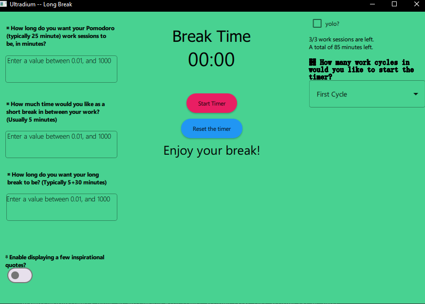
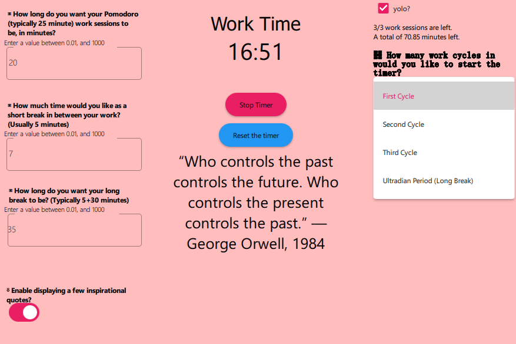

## Ultradium: A lightweight, customizable Qt application for work-break scheduling. Android, Windows and GNU-Linux. (Work in progress)

The app's name, Ultradium, is based on the existence of the *Ultradian Cycles*, typically 90 to 120 minute cycles in humans and other mammals    
or animal families, that govern the distribution of biological energy, i.e., work, focus and activity, and rest, i.e., sleep, relaxation and growth.

The knowledge of these cycles can help govern how we choose to engage in our work and other important activities,    
leading to a more balanced and attuned work-life schedule, and prevent burnout!

While some other apps in the open-source scene already make use of this ultradian cycle concept,    
I couldn't find any that combines **another** popular mechanism for proper work efficiency: The Pomodoro Technique,    
which states that many of us work best when we work for 25 minutes, and take a 5 minute break on each such interval.


Now joining together this 25 minute cycle followed by a 5 minute break idea,    
with the 90 minute work approach followed by a 30 minute (typically) break, I devised the thought for this app!


I no longer have to constantly remember my timings, and can delegate the full focus to the work at hand.    
I also included some inspirational quotes that I thought were worth a mention (some I struggled to justify a reason to still include).

----

# The current version of the app is very much a work-in-progress:
- There are many missing features, such as a journaling feature by day to keep track of your work
- A proper settings menu to declutter everything from the main landing interface
- Functioning notification system with Qt for Desktop and Mobile
- Beautifying and clearing up the app's GUI, which is somehwat of a mess at present, and others
- Oh and also, to compile for Android, which I still haven't tested

----

# Features:
- Combines 25-5 work-break split (Pomodoro) with a 90-30 work-break split (Ultradian)
- Allows selecting your own time ranges
- Pause, reset time as needed
- Ding sounds to notify of finished work or break periods
- Quotes...

# How to use:

The best way to use this app right now, is to clone the repo
```bash
git clone https://github.com/feeRnt/UltradiumTimer
```
and import the project into Qt Creator, then Build (& Run) it, or to build it manually using CMake directly after the clone:

```bash
cd UltradiumTimer
mkdir build_cmake_manual
cd build_cmake_maunal
cmake ..
# I have not tested manually with CMake like this before, but it should work.
# You will need to have your distro or OS' version of build-essentials installed beforehand of course.
```

Detailed instructions for compiling and pre-built, **small** (hopefully! I didn't realize how big Qt could get) binaries/packages will
be released in the future.

## What does it look like?

Despite its rudimentary nature, I thought I should paste some photos of the app. Here they are:




Did I mention there are quotes?


Credits: 
- https://www.asianefficiency.com/productivity/ultradian-rhythms/ , this pretty nice article introduced me to the topic some months back    
- Me: Coded it (please star if you think it's cool!)
- AI: Yes it helped, and gave boilerplate for the code early on in the initial phase
